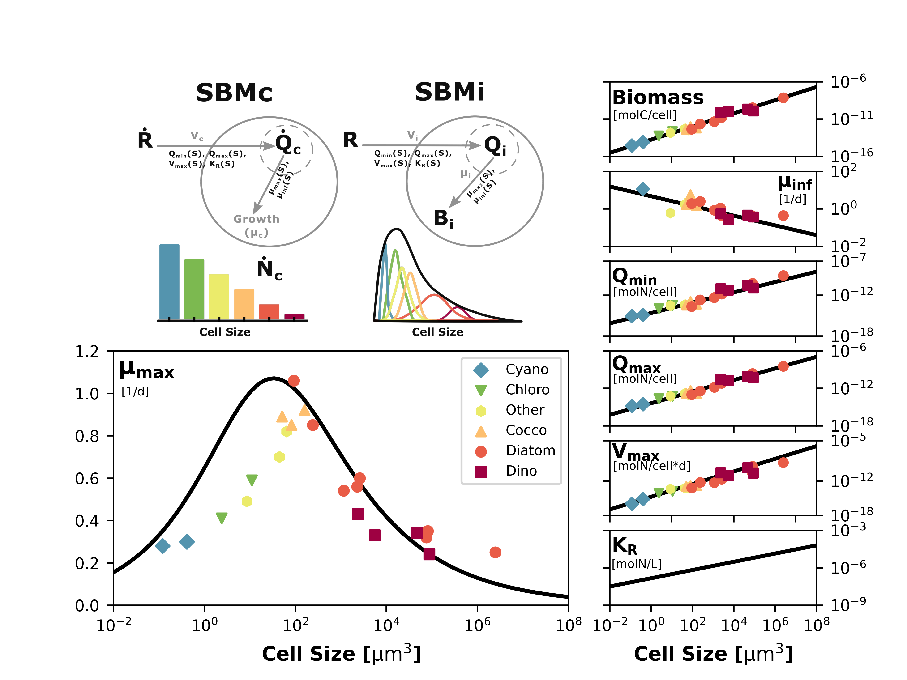
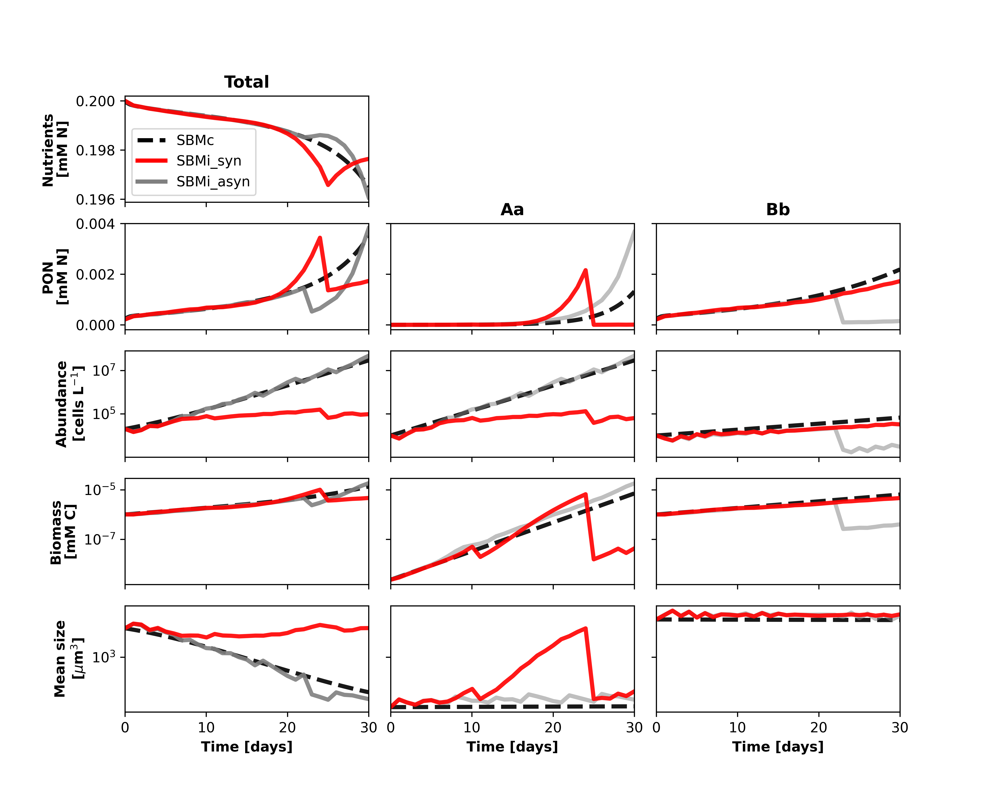
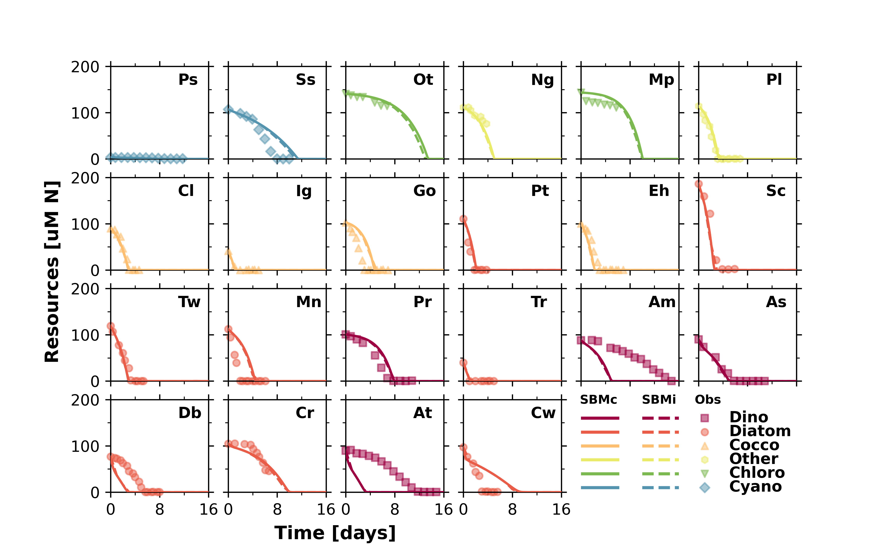
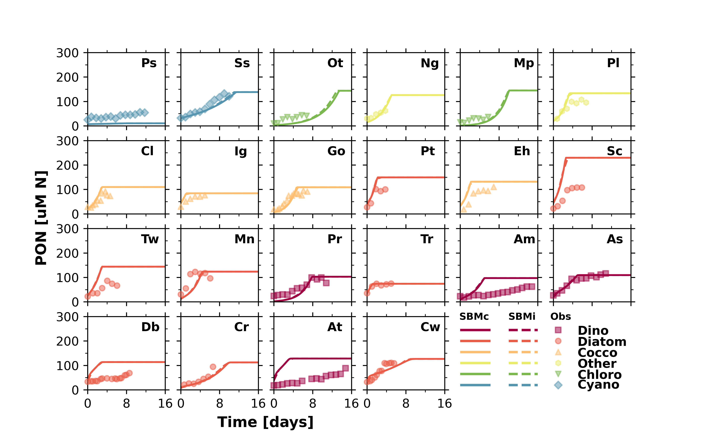
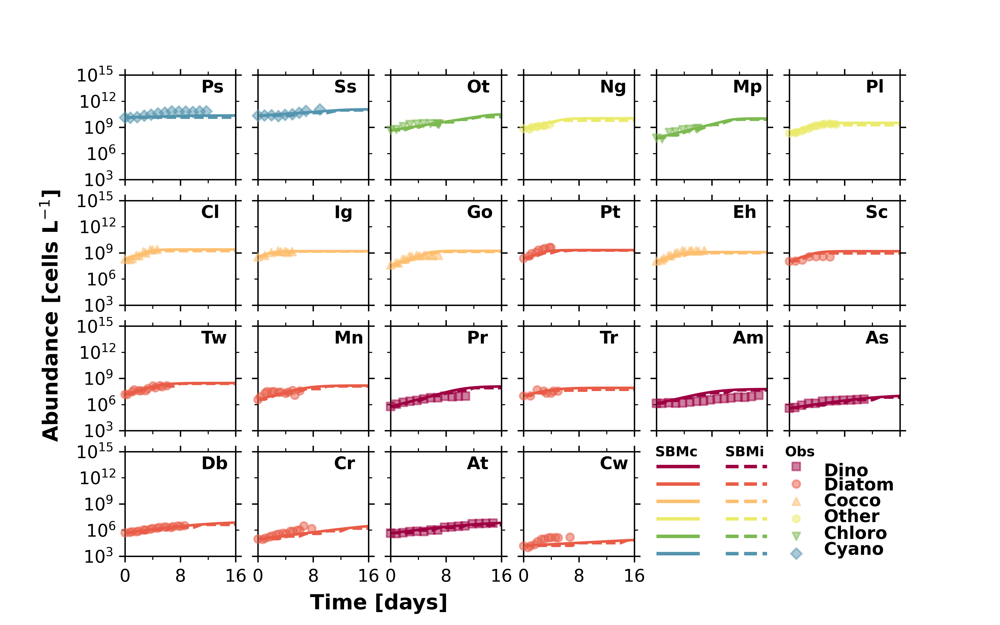
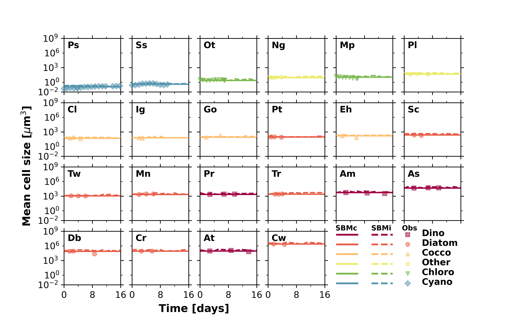

# insidephy: Inter- and intra-specific Size Diversity of Phytoplankton

*insidephy* is a package for modelling inter- and intra-specific 
size variability of phytoplankton. The package is designed to 
capture the growth dynamics of phytoplankton species under common
laboratory conditions, for example using batch cultures or chemostats.
*insidephy* is an open-source project written in Python, 
with routines to quantify phytoplankton community size composition
based on size classes (SBMc) or individuals (SBMi) and with parallelization routines
to improve the computation capacity of simulation experiments, particularly, 
those using the individual-based model type.

# Modelling approach
 We follow a trait-based modelling approach to capture the cell size 
 variability and to untangle the effects of intra- and interspecific 
 size variability on the assembly and functioning of phytoplankton 
 communities. An empirically derived trade-off is constructed based on
 the allometric relationships between cell size and maximum growth rate, 
 maximum uptake rate, maximum resource quota, minimum resource quota
 and nutrient half-saturation. These allometries allow
 phytoplankton cell sizes with different nutrient competitive abilities
 to be favoured as resource conditions change.


 
### Size-based model using size classes (SBMc)
In the package *insidephy*, the module ``SMBc`` contains a class
of the same name with a single method to quantify the size-based 
model resolving size classes. The SBMc model type consists of a system
of ordinary differential equations describing Droop's growth dynamics,
with state variables for the resource, the internal quota of each 
size class and the abundance or density of individuals on each size class.
The model is solved numerically using ``scipy.odeint`` library.

### Size-based model using individuals (SBMi)
In the package *insidephy*, the module ``SMBi`` contains two classes one 
that describes the agent and another with the routines to solve numerically
the individual-based model.

The agent class is named ``PhytoCell``, for which the cell size is assigned 
from a log-scaled size distribution within the provided size range 
(between a minimum and maximum cell size provided by the user). 
Using the assigned sizes to each cell, the other eco-physiological traits 
are determined using the above mentioned allometric relationships. 
The ``PhytoCell`` agent also has a method to update its growth based on 
the available resources following Droop's formulation similarly as for 
the SBMc model. 

The second class, named ``SBMi``, contains the routines to quantify the size-based model. 
The model has four main methods, named ``initialize``, ``update``, ``run`` and ``split-combine``.
The ``initialize`` method creates a given number of phytoplankton cell agents from the class ``PhytoCell`` 
all agents with a randomly selected size within the specified size range. The ``update`` method
contains the main rules that dictate how an agent reproduces and dies. The ``run`` method executes 
the model and saves the result into arrays (via method ``save_to_array``). Last, the ``split-combine`` method is the 
algorithm used to make sure the number of (super) individuals stays within a computationally 
tractable range. Below there is a flow diagram showing the steps taken during the execution of a single
time step of the SBMi model.


 

## Installation details

To install and utilize the *insidephy* package a running distribution 
of Python (preferably 3.7 or above) is required. To install 
*insidephy* simply download the tarball for the latest version of 
the package from the GitHub repository and install from the source as:
```bash
python install insidephy-0.0.1.tar.gz
```
##  Basic usage and minimal running example

Once the package has been successfully installed on Python, 
then specific modules of the *insidephy* package can be imported, 
for example, the SBMi model type as:
```python
from insidephy.size_based_models.SBMi import SBMi
```
To make a simulation first we need to define the initial conditions.
Here notice that some initial values have to be provided as a list or tuple:
```python
ini_resource = 0.0002
ini_density = [1e4, 1e4]
min_size = [1.5e1, 1.5e4]
max_size = [2.5e1, 2.5e4]
spp_names = ["Aa", "Bb"]
dilution_rate = 0.0
volume = 1.0
nsi_spp = [500, 500]
nsi_min = 200
nsi_max = 2000
time_end = 30
time_step = 1 / 24
```
Then to execute the simulation simply type:
```python
sbmi = SBMi(ini_resource=ini_resource, ini_density=ini_density, minsize=min_size, maxsize=max_size, spp_names=spp_names, dilution_rate=dilution_rate, volume=volume, nsi_spp=nsi_spp, nsi_min=nsi_min, nsi_max=nsi_max, time_step=time_step, time_end=time_end)
```
The result of the execution will be stored as multidimensional 
arrays in the object sbmi. The aggregate 
variables with only time dimension are ``resource``, ``biomass``, 
``abundance`` and ``quota``. The results of the model in dimensions per time
and agent are ``agents_size``, ``agensts_biomass`` and ``agents_abundance``. 
These results can be accessed as instances of ``SBMi`` object using 
the dot operator, like:
```python
sbmi.resource
sbmi.biomass
sbmi.abundance
sbmi.quota
sbmi.agents_size
sbmi.agents_biomass
sbmi.agents_abundance
```
Similarly, the ``SBMc`` model using the same parametrization can be calculated and
compared with the results of ``SBMi`` model. The full code to compute this example is included in the folder examples
as part of the minimal running example. The results of the comparison between SBMc and SBMi size-based
models can be found below. In the leftmost column are shown the temporal
dynamics of the main variables and by aggregating the results of 
the idealized species ``Aa`` and ``Bb``. The middle and rightmost column
summarizes the results for each of the idealized species. As can be observed both 
models captures similarly the temporal dynamics of the variables, with 
the exception of the mean cell size, which is here calculated as a weighted mean.





## Other examples

Other cases to calculate and store single and 
multiple species experiments using parallel computations are also included
in the same folder. For example, simulations using the 22 species reported by
Marañón et al. (2013 Eco. Lett.) show an agreement between observations and 
both size-model types.










## Relevant references

Acevedo-Trejos, E. Marañón, E., Hellweger F. L., and Merico A. (submitted) insidephy: A package for modelling inter- and intra-specific size variability of phytoplankton. 

Hellweger, F. L., & Kianirad, E. (2007). Individual-based modeling of phytoplankton: Evaluating approaches for applying the cell quota model. Journal of Theoretical Biology, 249(3), 554–565. https://doi.org/10.1016/j.jtbi.2007.08.020

Marañón, E., Cermeño, P., López-Sandoval, D. C., Rodríguez-Ramos, T., Sobrino, C., Huete-Ortega, M., Blanco, J. M., & Rodríguez, J. (2013). Unimodal size scaling of phytoplankton growth and the size dependence of nutrient uptake and use. Ecology Letters, 16(3), 371–379. https://doi.org/10.1111/ele.12052
